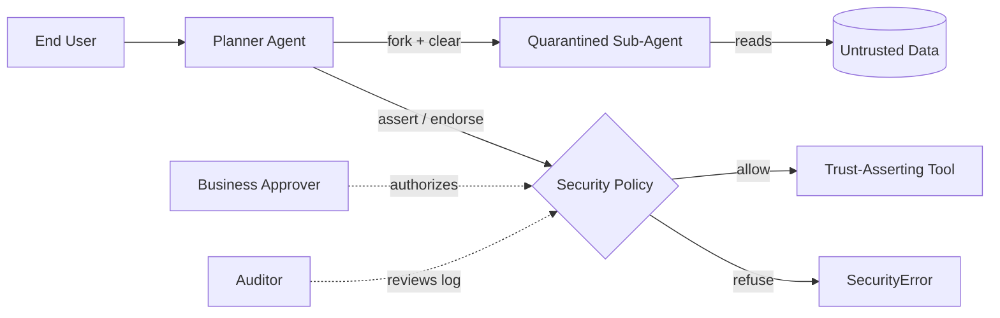

# Use Case Catalogue: The LLMbda Calculus

**Purpose:** Derive concrete, testable use cases from the source paper and
from this repository's own executable examples, as an input to
`BUSINESS_REQUIREMENTS.md`. Background, problem statement, and competitive
analysis are covered in `BUSINESS_ANALYSIS.md` and are not repeated here.
**Status:** Draft, for review.

Each use case is traced to (a) the paper section it is drawn from, and
(b) where applicable, a runnable example in this repository's
`examples/` directory that demonstrates the scenario end to end — i.e.
the use case is not just described, it has been executed and its stated
outcome verified (`pnpm test`). Where no repository evidence exists, this
is stated explicitly rather than implied.

---

## Actors

| Actor | Description |
|---|---|
| **End User** | The human whose instruction starts an agent task. |
| **Planner Agent (P-LLM)** | The privileged model that plans and issues tool calls; never reads untrusted data directly (dual-LLM pattern) or, in LLMbda, any code path that has not been explicitly isolated. |
| **Quarantined Sub-Agent (Q-LLM)** | A model instance confined to an isolated conversation (`fork`/`clear`); reads untrusted data but can only return a value, never issue a privileged call itself. |
| **Tool / External Data Source** | A function exposed to the agent (e.g. `read_file`, `send_money`, `read_url`) carrying its own provenance/trust label. |
| **Security Policy (system boundary)** | The label lattice, `assert`, and `endorse` mechanisms — not a human actor, but a first-class participant every use case interacts with. |
| **Business Approver** | A human or business-rule source authorizing an explicit reclassification (`endorse`) of data that would otherwise be blocked. |
| **Auditor / Compliance Reviewer** | Reviews logs of security-relevant decisions (blocked flows, overrides) after the fact. |
| **Attacker** | Not a legitimate actor — included for the misuse/abuse cases (UC-9, UC-10), which specify what the system must resist. |
| **Developer / Tool-Library Maintainer** | Adds or updates tools and their trust labels; an operational actor, not part of any single agent run. |

---

## UC-1: Extract and Normalise Structured Data from Free Text

- **Actor:** Planner Agent
- **Goal:** Turn several free-text inputs into a normalised structured
  value (e.g. postcodes), each processed independently.
- **Preconditions:** A reusable prompt/context has been established.
- **Trigger:** End User supplies a batch of inputs to normalise.
- **Main flow:**
  1. Planner establishes shared context once (`@`).
  2. For each input, Planner forks the context (`fork`), so each item is
     processed independently of the others' side effects.
  3. Each fork prompts the model and returns the parsed, normalised value.
  4. Results are collected into a single output.
- **Postconditions:** Output list is returned; the shared conversation
  outside each fork is unaffected by any individual item's processing.
- **Business rule invoked:** Isolation between independent sub-tasks is
  the default, not something the caller must remember to implement.
- **Source:** Paper §2.1.
- **Repo evidence:** `examples/postcode.ts` (passing).
- **Priority:** Low risk / high frequency — a good acceptance-test case
  for "does enforcement get in the way of ordinary work?"

## UC-2: Iteratively Generate and Repair Code via a Retry Loop

- **Actor:** Planner Agent
- **Goal:** Generate code for a task, test it, and repair it based on
  failure feedback, without an unbounded/untracked retry channel.
- **Preconditions:** A task description and a way to validate a candidate
  solution.
- **Trigger:** End User (or an upstream planning step) requests a
  generated function/program.
- **Main flow:**
  1. Planner prompts the model for a candidate implementation.
  2. Candidate is tested against known cases.
  3. On failure, the error is fed back into the next prompt and the loop
     repeats, within the same tracked conversation (not an external,
     untracked retry wrapper).
  4. On success, the loop terminates and returns the working code.
- **Alternative flow:** Retry budget exhausted — return failure rather
  than looping unboundedly.
- **Postconditions:** A working (or explicitly failed) result; every
  retry iteration remains inside the tracked conversation/label system,
  unlike the untracked Python retry loop identified as a leak channel in
  a competing system (§1).
- **Business rule invoked:** Retry/repair loops must not become an
  unmonitored side-channel for repeated probing.
- **Source:** Paper §2.2, §7.1 ("randori" practice-mode retry loop).
- **Repo evidence:** `examples/retry-loop.ts` (passing).
- **Priority:** High — this is the core pattern behind any code-generating
  agent, and the specific pattern a competing system (CaMeL) was shown to
  leak through when implemented outside the tracked interpreter.

## UC-3: Summarise or Classify Untrusted Content Before a Trust-Gated Action

- **Actor:** Planner Agent, Quarantined Sub-Agent, Tool
- **Goal:** Let untrusted content (e.g. an email) inform a decision
  without that content's taint blocking every subsequent action.
- **Preconditions:** A tool library exists with labelled sinks (e.g. a
  sink that requires a trusted classification).
- **Trigger:** End User asks the agent to triage or act on an inbound
  message.
- **Main flow:**
  1. Untrusted content is labelled at its source (e.g. `[U]`).
  2. Planner quarantines a classification prompt that embeds the
     untrusted content (`fork` + `clear`), isolating it from the main
     conversation.
  3. The classifier's answer genuinely inherits the untrusted label
     (Confinement) because it was produced from untrusted input.
  4. If the answer is in a known-safe category, a bounded-domain
     reclassification (`bounded_endorse`) washes it to trusted; if not,
     it remains untrusted.
  5. A trust-asserting sink (`assert`) is only reached for the washed,
     in-domain result.
- **Alternative flow:** Out-of-domain classification — the sink refuses
  (`SecurityError`), and the agent must handle the refusal (e.g. escalate
  to a human) rather than crash.
- **Postconditions:** Either the sink action completes on legitimately
  trusted data, or it is provably refused.
- **Source:** Paper §5.1 (quarantine + bounded_endorse).
- **Repo evidence:** `examples/quarantine-classify.ts` (passing, both
  branches).
- **Priority:** High — this is the canonical enterprise pattern (email
  triage, ticket routing, document classification) most directly
  requested by adopting teams.

## UC-4: Gate a Trust-Asserting Action on Data Provenance (Sources × Readers)

- **Actor:** Planner Agent, Tool
- **Goal:** Allow an action only when the data feeding it comes from an
  approved provenance (not just "trusted"/"untrusted" but a richer
  source taxonomy), independent of who is allowed to read it.
- **Preconditions:** A provenance lattice is configured (e.g. `web`,
  `internal-db`), separate from a readers/confidentiality axis.
- **Trigger:** Planner has produced a value that needs to reach a sink
  requiring a specific provenance.
- **Main flow:**
  1. Value is labelled with its actual source (e.g. `sources: {web}`).
  2. Sink asserts a required provenance (e.g. `sources: {internal-db}`).
  3. Assertion fails for web-sourced data (`SecurityError`), by design.
  4. An authorized reclassification (`endorse`) washes only the
     provenance (integrity) dimension to the approved source, leaving
     confidentiality (who may read it) unchanged.
  5. The same assertion now succeeds.
- **Postconditions:** The sink only ever executes on data whose
  provenance has been approved, either originally or via an explicit,
  audited override.
- **Business rule invoked:** Confidentiality and provenance are
  independent concerns and must be reclassifiable independently
  (Insulated TIPNI, Theorem 2).
- **Source:** Paper Appendix D.5 (CaMeL-style Sources×Readers lattice).
- **Repo evidence:** `examples/camel-provenance-quarantine.ts` (passing,
  both the refusal and the post-endorsement success).
- **Priority:** Medium-High — relevant wherever "trusted" is not binary
  (multi-tenant data, multiple external integrations).

## UC-5: Authorised Business Override of a Security Label

- **Actor:** Business Approver (via generated code), Planner Agent
- **Goal:** Let a plan explicitly declare "I accept the risk on this one
  value" without weakening protection anywhere else, and without that
  override being reusable to launder further data.
- **Preconditions:** A value is blocked by a policy the business has
  decided, in this specific case, should not apply.
- **Trigger:** Planner determines (at plan-generation time, before
  exposure to untrusted data) that an override is warranted.
- **Main flow:**
  1. Planner calls `endorse`/`robust_endorse` on the value, targeting a
     specific label.
  2. The value's other label dimension (e.g. confidentiality) is left
     untouched.
  3. An "endorsed" marker is stamped so the same value cannot be
     endorsed a second time (cascade prevention).
- **Alternative flow:** A second endorsement attempt on an already-
  endorsed value is refused (`SecurityError`) — the cascade the
  mechanism exists to prevent.
- **Postconditions:** Exactly one, auditable override has occurred; no
  chain of overrides can compound.
- **Business rule invoked:** Overrides must be single-use, explicit, and
  scoped — see BRule-2 in `BUSINESS_REQUIREMENTS.md`.
- **Source:** Paper §5.2, Appendix E.2 ("robust endorsement").
- **Repo evidence:** `examples/endorse.ts`,
  `examples/robust-endorse-cascade.ts` (both passing).
- **Priority:** High — this is the mechanism that determines whether
  "sound" and "usable" can coexist; also the mechanism identified as the
  source of both of Randori's residual attack successes (§7.3), so it
  is a priority use case for audit tooling (see UC-11).

## UC-6: Enforce a Sensitivity Label the Model Declares at Runtime

- **Actor:** Quarantined Sub-Agent, Security Policy
- **Goal:** Let the model itself flag output as sensitive (e.g. "this
  answer touches PII"), and have that dynamically-declared label
  enforced exactly as if a developer had written it as a literal.
- **Preconditions:** The model is prompted to return both an answer and
  a self-assessed sensitivity tag.
- **Trigger:** A response includes a sensitivity declaration the program
  did not know in advance.
- **Main flow:**
  1. Response is decoded into a value and a label (`labelDyn`).
  2. Ambient control flow that subsequently branches on that value is
     raised to the declared sensitivity for the branch taken.
  3. Any attempt to send data out from within that raised context is
     checked against the destination's label exactly as for a
     compile-time label.
- **Postconditions:** A model-declared secret is enforced with the same
  rigor as a program-declared one; no special-casing is needed.
- **Source:** Paper §3.2 (dynamic labels).
- **Repo evidence:** `examples/dynamic-label.ts` (passing).
- **Priority:** Medium — important for scenarios where sensitivity
  genuinely cannot be known until the model classifies its own output
  (e.g. PII detection, content moderation).

## UC-7: Isolate a Sub-Task's Conversation History from the Main Session

- **Actor:** Planner Agent, Quarantined Sub-Agent
- **Goal:** Ensure a quarantined sub-call does not see prior conversation
  turns it has no need to know (data minimisation), not merely that its
  effects don't leak back out.
- **Preconditions:** A main conversation already contains prior turns
  (potentially sensitive).
- **Trigger:** Planner needs a sub-task performed on new input, without
  exposing prior context to it.
- **Main flow:**
  1. Planner forks the conversation for the sub-task.
  2. The fork clears history before prompting, so the sub-call's prompt
     starts from a blank transcript.
  3. Sub-call proceeds and returns a value; the outer conversation
     (history and label) is restored unaffected on return.
- **Postconditions:** Verified (not merely assumed) that the sub-call's
  prompt never contained the prior turns.
- **Business rule invoked:** "Isolated" must mean isolated on the way
  *in*, not only on the way out.
- **Source:** Paper §3.1, §5.1 (mechanism behind `quarantine`).
- **Repo evidence:** `examples/clear-isolation.ts` (passing; directly
  inspects what the mock LLM oracle receives, proving no leak).
- **Priority:** Medium — a data-minimisation/privacy requirement as much
  as a security one; relevant wherever a sub-agent call is outsourced to
  a cheaper/less-trusted model.

## UC-8: Autonomous Agent Executes a Multi-Step Task Involving Money Movement

- **Actor:** End User, Planner Agent, Quarantined Sub-Agent, Tool
  (banking API)
- **Goal:** Complete a realistic, high-consequence task (e.g. "read my
  friend's payment details from their website and send them $50")
  end-to-end, resisting any injected instruction encountered along the
  way.
- **Preconditions:** A tool library exists with per-tool trust labels
  (e.g. `read_url` output is untrusted; `send_money` requires untainted
  input).
- **Trigger:** End User issues a natural-language instruction.
- **Main flow:**
  1. Planner writes code (a "plan") for the task; the plan runs, invoking
     tools as needed.
  2. Untrusted reads (web page, file, inbox) are labelled accordingly.
  3. Where untrusted data must legitimately feed a trust-asserting tool
     (e.g. the payment amount came from a webpage), the plan explicitly
     endorses that value, as in UC-5.
  4. If a plan iteration fails, the agent retries in a practice/mock
     mode (UC-2 pattern) before touching the real world.
  5. The trust-asserting tool executes only if all its input labels
     satisfy its declared policy.
- **Alternative/abuse flow:** Untrusted content contains an injected
  instruction attempting to redirect the payment. Because the
  instruction-carrying data is labelled untrusted and the sink demands
  untainted input, the action is refused unless explicitly (and validly)
  endorsed — see UC-9 for the case where refusal is the required outcome.
- **Postconditions (paper's benchmark, for context):** In the reference
  evaluation (AgentDojo banking suite, 16 tasks × 9 attacks × 3 models),
  this pattern completed tasks at a rate statistically indistinguishable
  from an unprotected baseline, while resisting 1294/1296 attacked runs.
- **Source:** Paper §7 (Randori agent and evaluation).
- **Repo evidence:** Not directly ported into this repository (Randori
  is a larger, tool-integrated agent outside this port's current scope —
  see `BUSINESS_ANALYSIS.md` NFR-2/R-3). Flagged as a **recommended
  future example** if this repository is used for deeper prototyping.
- **Priority:** Highest — this is the flagship business scenario the
  whole calculus is justified by; it is also the one use case in this
  catalogue not yet demonstrated in this repository.

## UC-9 (Misuse case): Attacker Attempts an Implicit-Flow Leak via an Untaken Branch

- **Actor:** Attacker (via injected content), Security Policy
- **Goal (attacker's):** Exfiltrate a secret by structuring a
  conditional so the secret only influences a branch that is *not*
  executed, hoping a purely dynamic tracker fails to taint the
  assignment it never runs (the Fenton/Denning gadget reproduced against
  a competing system in §1).
- **Preconditions:** A secret-labelled value exists in scope; the
  attacker controls, or has injected, code that branches on it.
- **Trigger:** Injected/attacker-influenced code attempts to `send` on
  the untaken-branch path.
- **Main flow (must fail):**
  1. A branch is taken based on a secret condition, raising the ambient
     program counter for that branch.
  2. Inside the branch, an attempt to send data to a lower-labelled
     destination is evaluated.
  3. The system refuses (`SecurityError`) because the ambient,
     secret-raised program counter does not flow to the destination's
     label — regardless of which branch was or wasn't taken.
- **Postconditions:** No secret-dependent data reaches an unauthorised
  destination through this class of attack, by proof (Theorem 1), not
  merely by test.
- **Source:** Paper §1 (motivating example), §3.4.
- **Repo evidence:** `examples/fenton-denning-leak.ts`,
  `examples/var-pc-confinement.ts` (both passing — the latter is this
  repository's own regression test for a real instance of this exact bug
  class found during the TypeScript port, see `README.md`).
- **Priority:** Highest — this is the specific, named vulnerability class
  the calculus exists to close, and the one most directly falsifiable by
  a competing system's own published behaviour.

## UC-10 (Misuse case): Attacker Attempts to Launder a Secret via an Untracked Retry Loop

- **Actor:** Attacker, Security Policy
- **Goal (attacker's):** Exploit an untracked wrapper around the
  interpreter (e.g. an external retry loop) to iterate a pass/fail
  security decision and extract a secret one bit per attempt — the
  second concrete leak identified against a competing system in §1.
- **Preconditions:** A retry/repair loop exists around agent execution.
- **Trigger:** Repeated invocation of the same task with observation of
  each attempt's success/failure.
- **Main flow (must fail to leak):** Because LLMbda requires the retry
  loop itself to be expressed *inside* the tracked calculus (UC-2) rather
  than in an external, untracked wrapper, every retry's outcome remains
  subject to the same label discipline as a single run — there is no
  side channel outside the proof's scope for an attacker to iterate.
- **Postconditions:** No more information is leaked across N retries
  than the calculus's termination-insensitive bound already accounts for
  (Lemma 5, quantitative bound on leak from divergence).
- **Source:** Paper §1 (second motivating example, citing Birgisson &
  Sabelfeld's multi-run security).
- **Repo evidence:** **Not currently demonstrated in this repository.**
  `examples/retry-loop.ts` shows the *positive* retry pattern (UC-2) but
  does not include an adversarial variant proving the untracked-channel
  failure mode is actually closed. Recommended as a follow-up regression
  example (see `BUSINESS_REQUIREMENTS.md`, gap FR-9).
- **Priority:** High — directly relevant wherever an adopting team's
  agent framework wraps retries outside the enforcement boundary, which
  is the default in most current agent frameworks.

## UC-11: Auditor Reviews Endorsement Usage for Policy Compliance

- **Actor:** Auditor / Compliance Reviewer
- **Goal:** Establish, after the fact, that every override of the
  default security policy (`endorse`) in a given period was legitimate
  and none was used to launder untrusted data.
- **Preconditions:** Agent runs have been logged, including every
  `endorse` call site, its target label, and the value it was applied to.
- **Trigger:** Scheduled or incident-driven compliance review.
- **Main flow:**
  1. Auditor pulls the log of endorsement events for the review period.
  2. Each event is checked against the business rule it should satisfy
     (e.g. endorsements only at plan-generation time, before exposure to
     untrusted data — Appendix E.1's "pc bound").
  3. Any endorsement not traceable to an approved business rule is
     escalated.
- **Postconditions:** A pass/fail compliance determination, with
  every override individually reviewable (not inferred from aggregate
  behaviour).
- **Business rule invoked:** Auditability of overrides is a first-class
  requirement, not an afterthought (see BRule-3).
- **Source:** Derived from paper §5.2 and Appendix E.1; not an explicit
  worked example in the paper.
- **Repo evidence:** **Not currently demonstrated.** No example or
  library code in this repository currently emits a structured
  audit log of endorsement events. Recommended as a follow-up
  requirement (see `BUSINESS_REQUIREMENTS.md`, gap NFR-6).
- **Priority:** High for any compliance-relevant deployment; this is the
  operational counterpart to the formal guarantee in R-1/BR-3.

## UC-12: Developer Adds a New Tool with a Provenance/Trust Label

- **Actor:** Developer / Tool-Library Maintainer
- **Goal:** Extend the agent's tool library with a new capability,
  correctly labelling its trust requirements so the calculus's
  guarantees continue to hold without the developer having to reason
  about the whole system.
- **Preconditions:** A tool library convention exists (label the tool's
  outputs by provenance; label its required inputs by policy).
- **Trigger:** A new integration is needed (e.g. a new external API).
- **Main flow:**
  1. Developer defines the tool as a labelled function: output
     provenance for data it returns, required input policy for data it
     consumes.
  2. The tool is added to the library exposed to the planner.
  3. No changes are needed elsewhere in the system — Theorem 2's
     guarantee holds as long as sources are labelled correctly and sinks
     check at the point of use.
- **Postconditions:** The new tool participates correctly in every
  existing use case above without bespoke integration work.
- **Business rule invoked:** Security correctness must be a property of
  correctly labelling one new tool, not of re-auditing the whole system
  each time one is added.
- **Source:** Paper §7.1 ("Tools are the agent's interface to the
  untrusted outside world, and it is at this interface that we describe
  the security policies"), §9 conclusion (library developer's
  obligation).
- **Repo evidence:** Indirectly demonstrated by this repository's own
  `src/prelude.ts` pattern (tool-like closures registered once, reused
  across every conversation) and by each example's `Model`
  construction, though no example specifically frames "add a new tool"
  as its subject.
- **Priority:** Medium — an operational/maintainability use case rather
  than a per-run security use case, but decisive for total cost of
  ownership.

---

## Traceability Summary

| Use Case | Paper Source | Repo Evidence | Status |
|---|---|---|---|
| UC-1 | §2.1 | `examples/postcode.ts` | Demonstrated |
| UC-2 | §2.2, §7.1 | `examples/retry-loop.ts` | Demonstrated |
| UC-3 | §5.1 | `examples/quarantine-classify.ts` | Demonstrated |
| UC-4 | Appendix D.5 | `examples/camel-provenance-quarantine.ts` | Demonstrated |
| UC-5 | §5.2, Appendix E.2 | `examples/endorse.ts`, `examples/robust-endorse-cascade.ts` | Demonstrated |
| UC-6 | §3.2 | `examples/dynamic-label.ts` | Demonstrated |
| UC-7 | §3.1, §5.1 | `examples/clear-isolation.ts` | Demonstrated |
| UC-8 | §7 | — | **Gap** |
| UC-9 | §1, §3.4 | `examples/fenton-denning-leak.ts`, `examples/var-pc-confinement.ts` | Demonstrated |
| UC-10 | §1 | — | **Gap** |
| UC-11 | §5.2, App. E.1 (derived) | — | **Gap** |
| UC-12 | §7.1, §9 (derived) | `src/prelude.ts` pattern (indirect) | Partial |
